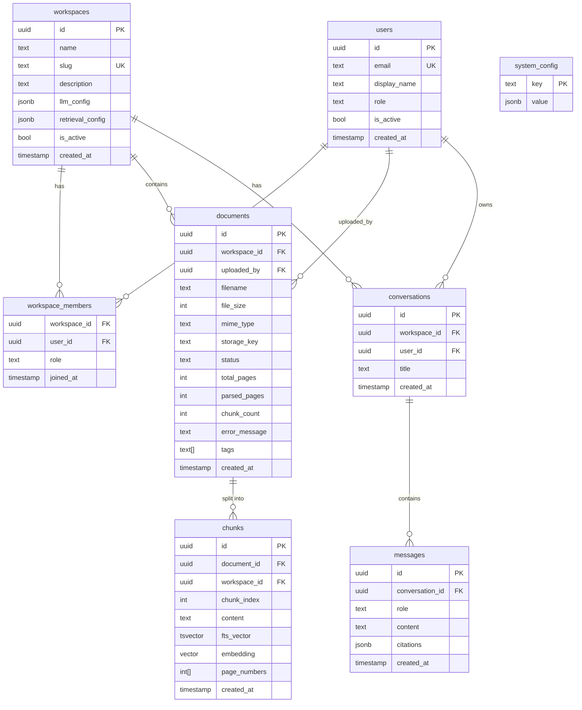
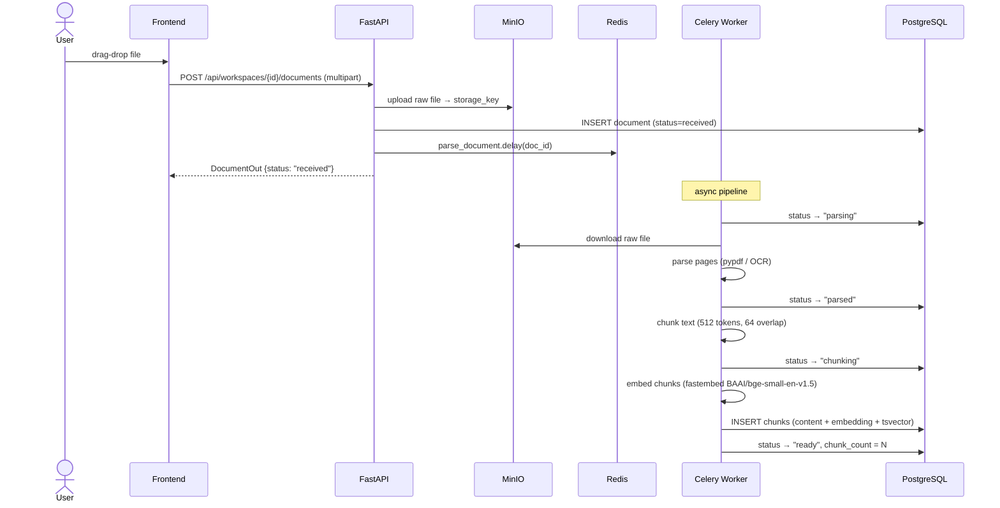
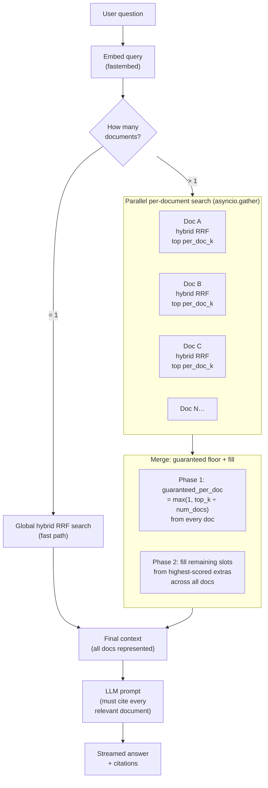
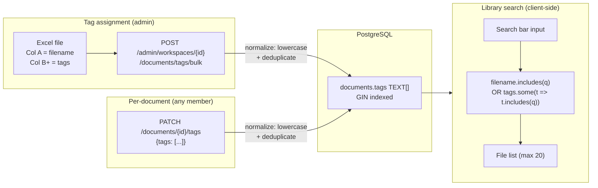
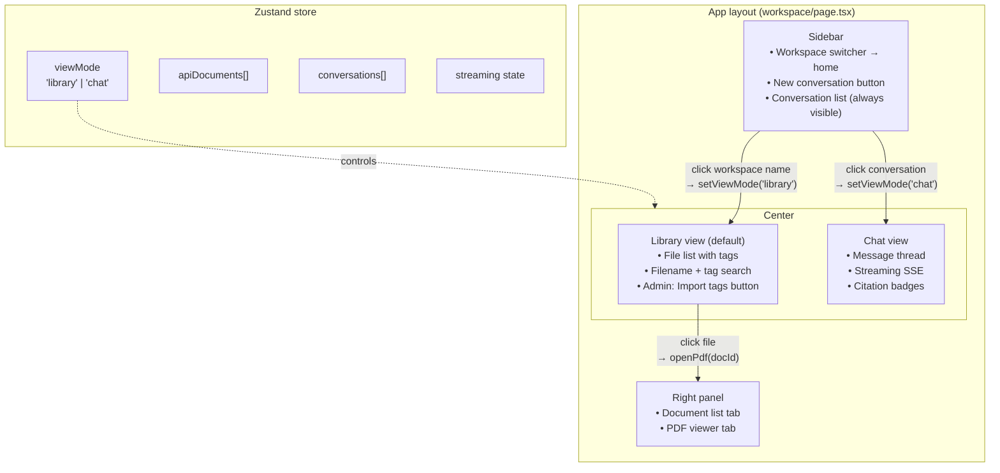
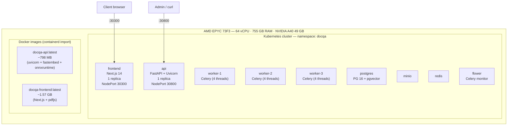

# NpuDen DocQA — Architecture Reference

> **What this doc is:** A current-state snapshot of every layer of the system — what exists, how it connects, and why key decisions were made.
> Last updated: August 2026.
>
> Related docs: `BUILD_PHASES.md` (phase history) · `RETRIEVAL_DESIGN.md` (SPD-RAG deep dive) · `docs/infra-audit-2026-07-22.md` (server sizing)

---

## System Overview

DocQA is an enterprise RAG (Retrieval-Augmented Generation) platform. Users upload documents into workspaces, ask questions in natural language, and receive answers grounded in the uploaded content — with citations pointing to exact pages.

Key design constraints:
- **Air-gapped friendly** — runs fully on-premises with Ollama; no data leaves the network
- **Multi-tenant** — workspaces isolate documents and conversations; role-based access (admin / member / viewer)
- **No hallucination leakage** — the system prompt forces the LLM to cite every document it draws from

---

## 1. Full System Architecture

```mermaid
graph TB
    Browser["Browser\n(Next.js client)"]

    subgraph K8s["Kubernetes — namespace: docqa"]
        FE["Frontend Pod\n(Next.js 14 SSR)\nNodePort :30300"]
        API["API Pod\n(FastAPI + Uvicorn)\nNodePort :30800"]
        Worker["Celery Worker Pod\n(document pipeline)"]
        PG[("PostgreSQL 16\n+ pgvector extension\n:5432")]
        Minio[("MinIO\nS3-compatible object store\n:9000")]
        Redis[("Redis\nCelery broker/backend\n:6379")]
    end

    LLM["LLM Backend\n(Ollama / OpenAI-compat)"]

    Browser -->|"HTTP :30300\nrelative /api/* calls"| FE
    FE -->|"Next.js rewrite\n/api/* → http://api:8000/api/*"| API
    API -->|async SQLAlchemy| PG
    API -->|boto3 / aioboto3| Minio
    API -->|Celery .delay()| Redis
    Redis -->|task queue| Worker
    Worker -->|pgvector INSERT| PG
    Worker -->|object upload| Minio
    API -->|HTTP| LLM
```

**Why Next.js rewrites instead of a direct API URL:**
`NEXT_PUBLIC_*` variables are baked at Docker build time. Rather than hardcoding the server IP, the frontend sends all `/api/*` calls to itself; Next.js proxies them server-side to `http://api:8000`. The browser never needs to know the backend address.

---

## 2. Data Model



### Tags — design note

`documents.tags` is a `TEXT[]` column with a **GIN index** (`ix_documents_tags_gin`). This is the standard PostgreSQL pattern for tag systems:

| Query | Operator | Uses GIN index |
|---|---|---|
| Documents that have tag "finance" | `tags @> ARRAY['finance']` | ✓ |
| Documents that have any of these tags | `tags && ARRAY['finance','legal']` | ✓ |
| Partial text match on any tag | `array_to_string(tags,' ') ILIKE '%fin%'` | ✗ (sequential scan — acceptable at current scale) |

Tags are always **lowercased and deduplicated** on write (PATCH endpoint normalizes before saving).

---

## 3. Document Upload & Processing Pipeline



**Supported formats:** PDF, DOCX, XLSX, PPTX, PNG, JPEG, TIFF

**Parser:** `pypdf` for text PDFs; OCR-capable fallback for scanned documents

**Embedding model:** `BAAI/bge-small-en-v1.5` via `fastembed` (runs on CPU in the worker pod, no GPU required)

---

## 4. SPD-RAG — Multi-Document Retrieval

SPD-RAG (Source-Parallel Document RAG) ensures every indexed document gets a fair chance to contribute to an answer. Without it, large documents monopolize the top-K retrieval slots.



**Search method:** PostgreSQL hybrid — `pgvector` cosine similarity + full-text `tsvector` ranked with Reciprocal Rank Fusion (RRF)

---

## 5. Tag System



**Excel import result codes:**
- `updated` — filename matched, tags replaced
- `not_found` — no document with that filename in the workspace
- `error` — unexpected failure on that row

---

## 6. Frontend Architecture



**View mode transitions:**
- App loads → `library` (home page)
- Click any conversation → `chat`
- Click New Conversation → `chat`
- Click workspace name (top of sidebar) → `library`

---

## 7. API Surface

| Method | Path | Auth | Description |
|--------|------|------|-------------|
| POST | `/api/auth/register` | public | Create account |
| POST | `/api/auth/login` | public | JWT login |
| GET | `/api/auth/me` | bearer | Current user |
| GET | `/api/workspaces` | bearer | My workspaces |
| POST | `/api/workspaces` | bearer | Create workspace |
| GET | `/api/workspaces/{id}/documents` | member | List docs (supports `?q=`) |
| POST | `/api/workspaces/{id}/documents` | member | Upload file |
| GET | `/api/documents/{id}` | member | Get doc metadata |
| PATCH | `/api/documents/{id}/tags` | member | Set tags |
| DELETE | `/api/documents/{id}` | member | Delete doc |
| GET | `/api/documents/{id}/file` | member | Stream file bytes |
| GET | `/api/workspaces/{id}/conversations` | member | List conversations |
| POST | `/api/workspaces/{id}/conversations` | member | New conversation |
| GET | `/api/conversations/{id}/messages` | member | Message history |
| POST | `/api/conversations/{id}/chat` | member | SSE streaming chat |
| DELETE | `/api/conversations/{id}` | member | Delete conversation |
| GET | `/api/admin/llm/config` | admin | Global LLM config |
| PATCH | `/api/admin/llm/config` | admin | Update LLM config |
| GET | `/api/admin/retrieval/config` | admin | Retrieval params |
| PATCH | `/api/admin/retrieval/config` | admin | Update retrieval params |
| GET | `/api/admin/users` | admin | List all users |
| POST | `/api/admin/users` | admin | Create user |
| PATCH | `/api/admin/users/{id}/role` | admin | Change role |
| PATCH | `/api/admin/users/{id}/active` | admin | Activate/deactivate |
| GET | `/api/admin/workspaces` | admin | All workspaces |
| POST | `/api/admin/workspaces/{id}/documents` | admin | Upload to any workspace |
| POST | `/api/admin/workspaces/{id}/bulk-upload-zip` | admin | Bulk upload from .zip |
| POST | `/api/admin/workspaces/{id}/documents/tags/bulk` | admin | Import tags from .xlsx |
| GET/PATCH/DELETE | `/api/admin/workspaces/{id}/llm` | admin | Per-workspace LLM override |
| GET/POST/PATCH/DELETE | `/api/admin/workspaces/{id}/members` | admin | Workspace membership |

---

## 8. Infrastructure (K8s on-premises)



**Deploy sequence** (required for every image update — K8s uses containerd, not Docker daemon):
```bash
docker build --target api -t docqa-api:latest .
docker build --target frontend -t docqa-frontend:latest .
docker save docqa-api:latest | sudo ctr -n k8s.io images import -
docker save docqa-frontend:latest | sudo ctr -n k8s.io images import -
kubectl delete pod -n docqa -l app=api
kubectl delete pod -n docqa -l app=frontend
```

**Known optimization opportunities** (from `docs/infra-audit-2026-07-22.md`):
- Multi-stage Dockerfile for api: 798 MB → ~350 MB (remove build-time deps)
- Next.js standalone output: 1.57 GB → ~300 MB
- Reduce Celery workers from 3 × 4 threads → 2 × 2 threads (A40 at 0% utilization)

---

## 9. Tech Stack Summary

| Layer | Technology | Notes |
|-------|-----------|-------|
| Frontend | Next.js 14 (App Router) | SSR + client components |
| UI state | Zustand | Single store, no Redux |
| Styling | Inline CSS with CSS variables | Airbnb design tokens |
| PDF viewer | pdfjs-dist | Worker served locally (no CDN) |
| API | FastAPI (Python 3.11) | Async, Pydantic v2 |
| ORM | SQLAlchemy 2 (async) | Mapped columns |
| Auth | JWT (python-jose) | Built-in; SSO deferred |
| Task queue | Celery + Redis | Document parsing pipeline |
| Embeddings | fastembed — BAAI/bge-small-en-v1.5 | CPU, no GPU required |
| Vector search | pgvector (PostgreSQL extension) | cosine similarity |
| Full-text search | PostgreSQL tsvector | Combined with pgvector via RRF |
| Tag index | PostgreSQL GIN on TEXT[] | `@>` and `&&` operators |
| Object storage | MinIO | S3-compatible, on-premises |
| LLM | Ollama (default) + OpenAI-compat | Per-workspace override |
| Container runtime | containerd (K8s) | `ctr -n k8s.io images import` |
