# NpuDen DocQA — Visual Architecture

> All diagrams in Mermaid format.  
> Companion to: `npuden-docqa-architecture-plan-v2.md`  
> Version 2.0 — May 2026

---

## 1. System Architecture (High-Level)

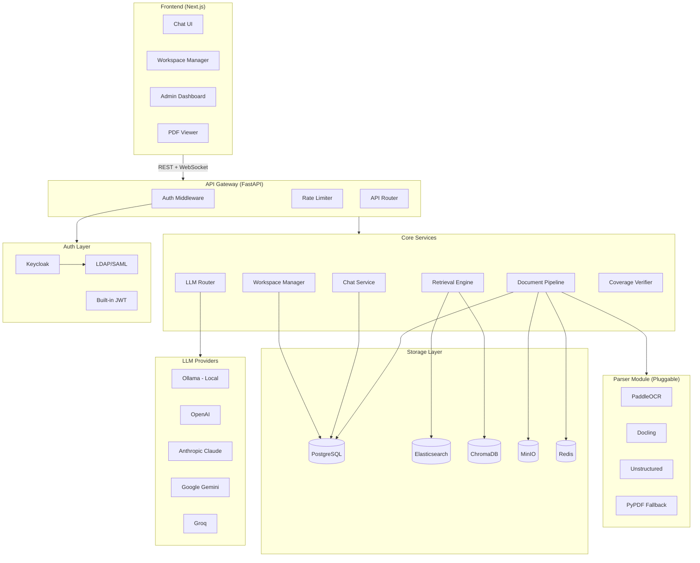

---

## 2. Document Upload & Processing Pipeline

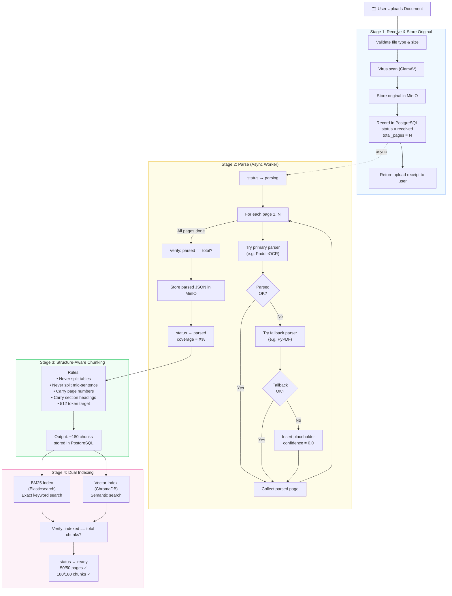

---

## 3. Full Document Coverage Guarantee

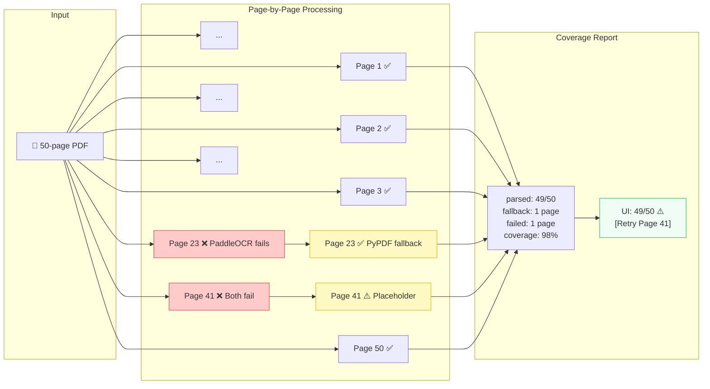

---

## 4. Parser Module Architecture (Pluggable)

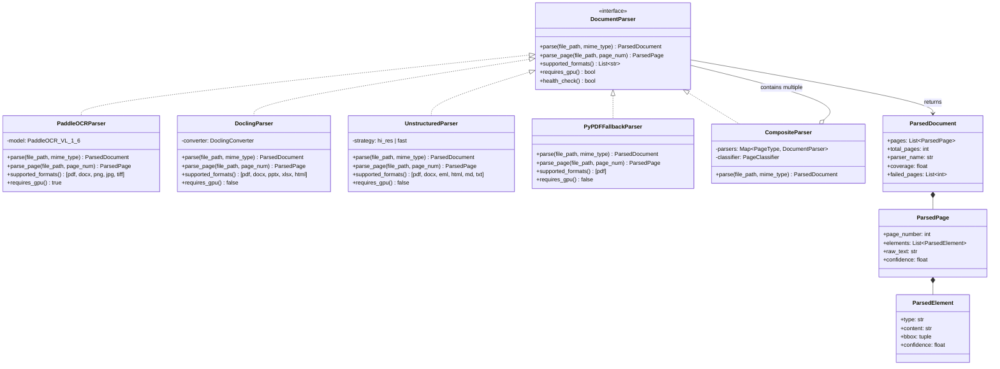

---

## 5. Triple Retrieval Pipeline

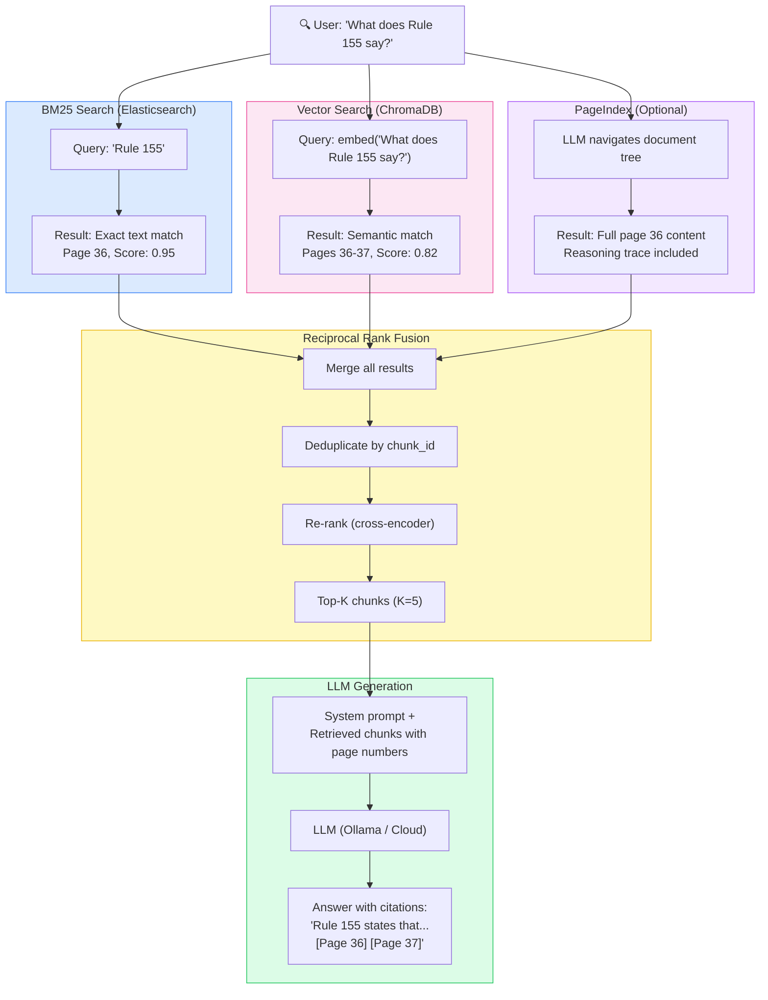

---

## 6. Hardware Compatibility Tiers

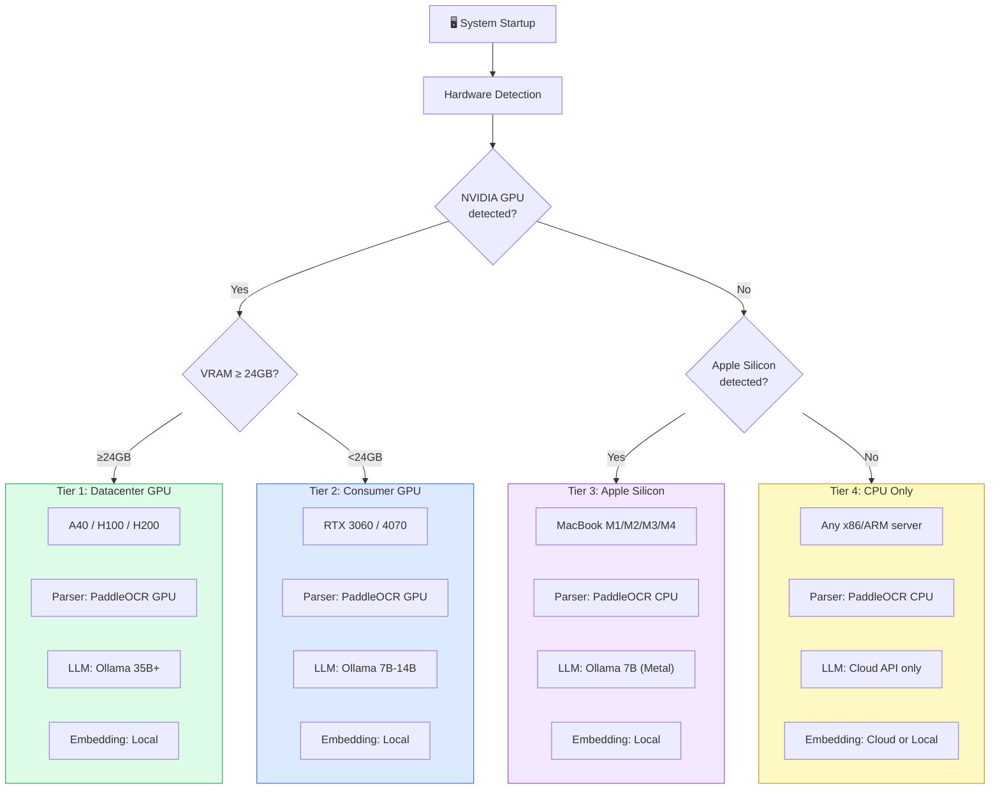

---

## 7. LLM Provider Routing

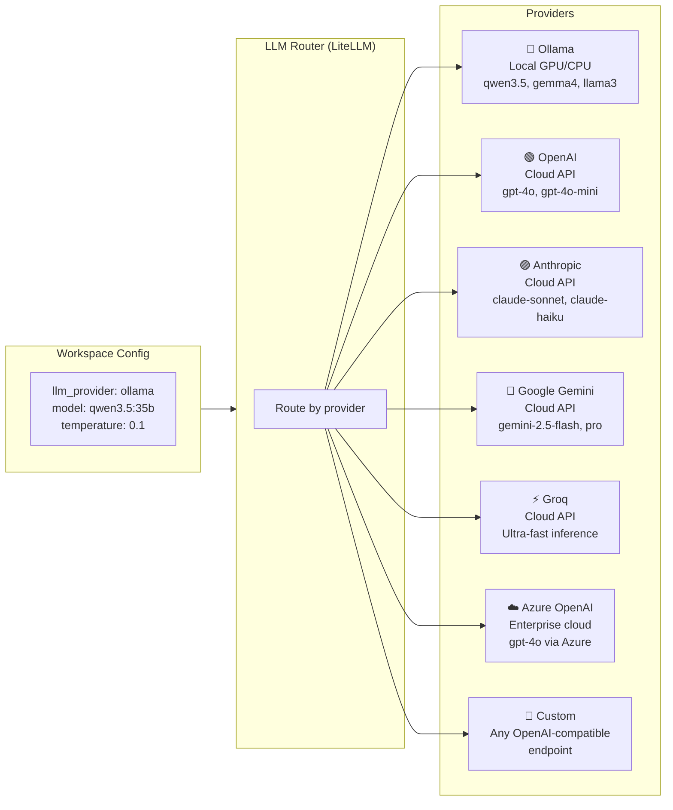

---

## 8. User Auth Flow

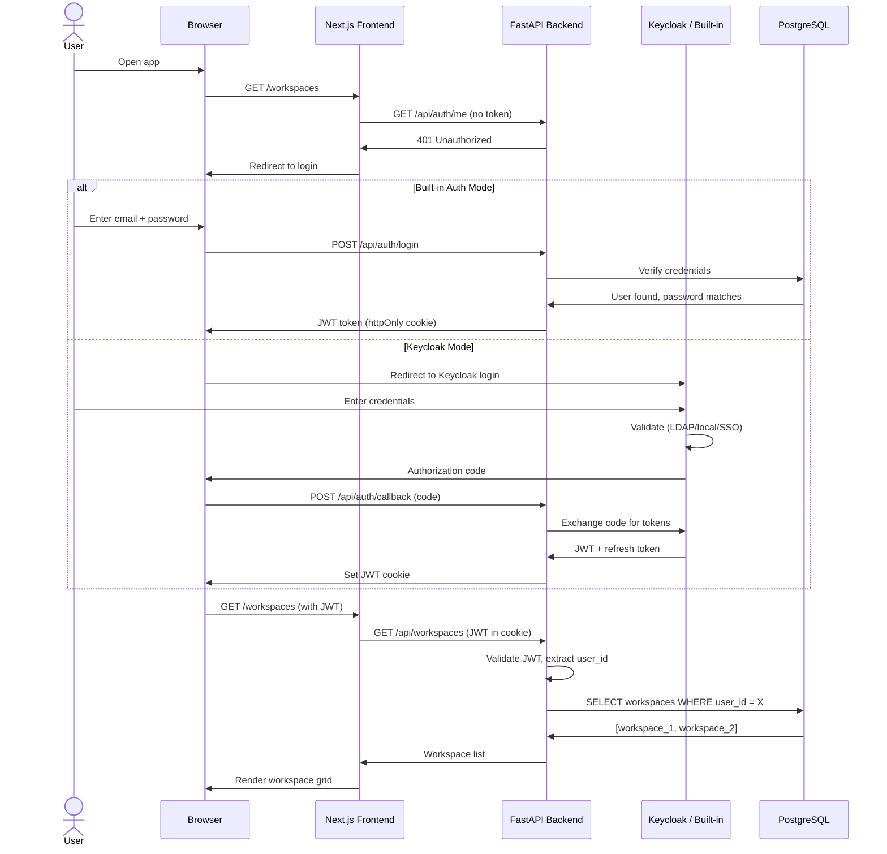

---

## 9. Workspace Data Isolation

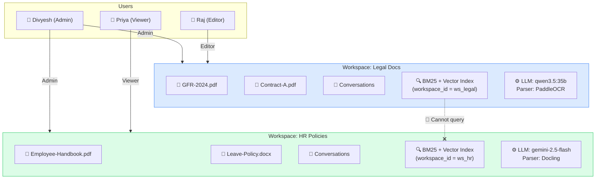

---

## 10. Chat Flow (End-to-End)

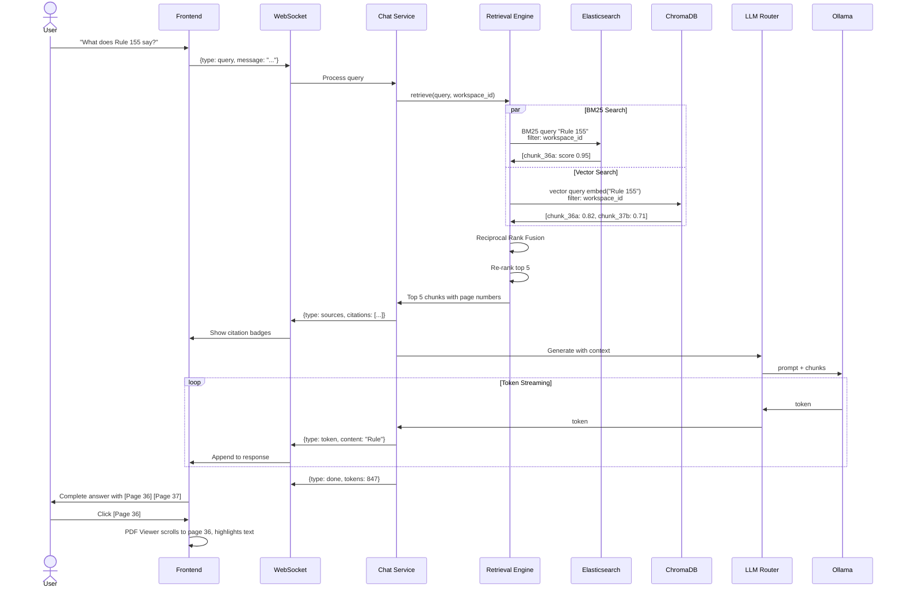

---

## 11. Deployment Options

```mermaid
flowchart TD
    subgraph Mode1["Mode 1: Docker Compose (Simple)"]
        DC_CMD["docker compose --profile gpu up -d"]
        DC_STACK["All services on one machine<br/>API + Frontend + Parser + DB + Ollama"]
        DC_USE["Best for: Teams < 50, demos, dev"]
    end

    subgraph Mode2["Mode 2: Kubernetes (Enterprise)"]
        K8S_NS1["Namespace: npuden-docqa<br/>API (x4) + Frontend (x2) +<br/>Workers (x4) + Parser + DBs"]
        K8S_NS2["Namespace: auth<br/>Keycloak + PostgreSQL"]
        K8S_NS3["Namespace: ai-services<br/>Ollama (GPU)"]
        K8S_USE["Best for: 50-10K users, HA, scaling"]
    end

    subgraph Mode3["Mode 3: Helm Chart (One-Command)"]
        HELM_CMD["helm install docqa npuden/docqa<br/>--set gpu.enabled=true<br/>--set auth.mode=keycloak"]
        HELM_USE["Best for: Repeatable client deployments"]
    end

    DC_CMD --> DC_STACK --> DC_USE
    K8S_NS1 --- K8S_NS2 --- K8S_NS3 --> K8S_USE
    HELM_CMD --> HELM_USE

    style Mode1 fill:#dbeafe,stroke:#3b82f6
    style Mode2 fill:#dcfce7,stroke:#22c55e
    style Mode3 fill:#f3e8ff,stroke:#9333ea
```

---

## 12. Database Schema (ER Diagram)

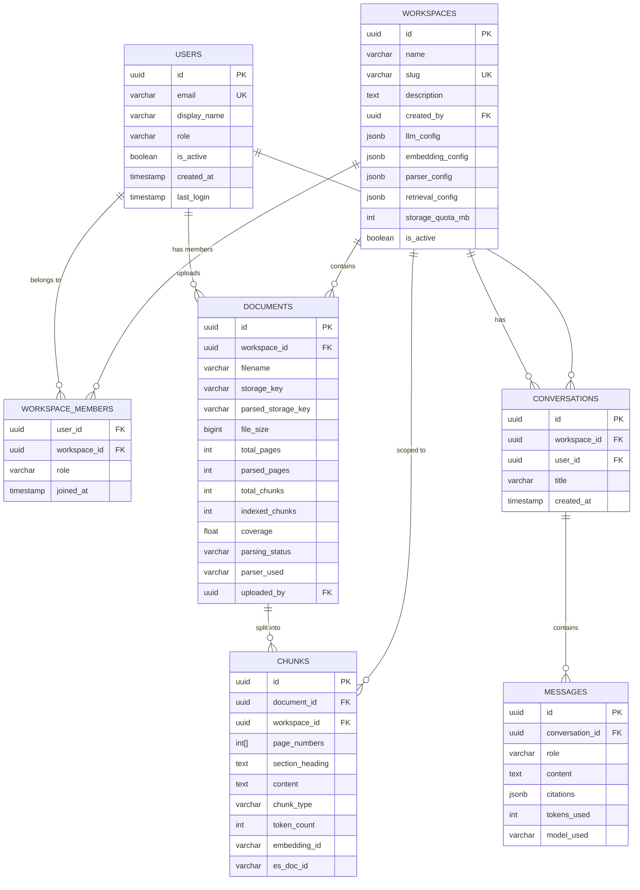

---

## 13. Development Phase Timeline

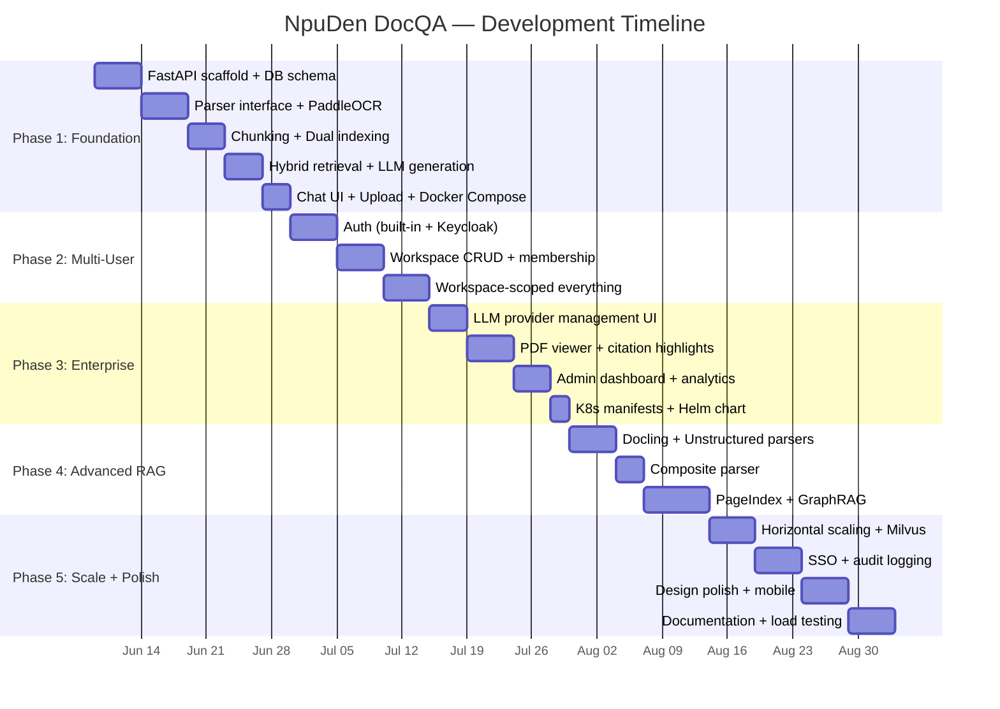

---

## 14. Storage Architecture

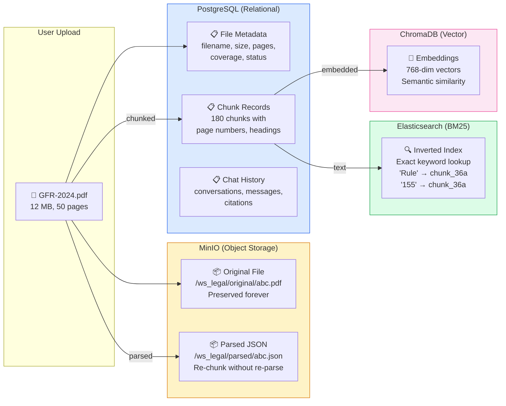

---

## 15. Frontend Page Map

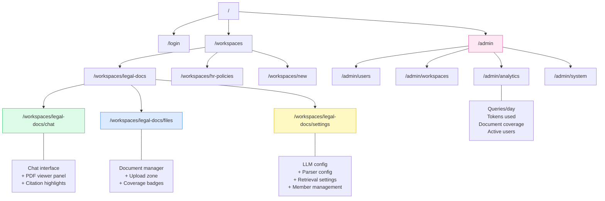

---

*Visual companion to the NpuDen DocQA Architecture Plan v2.*  
*All diagrams render in any Mermaid-compatible viewer (GitHub, VS Code, Obsidian, etc.)*
